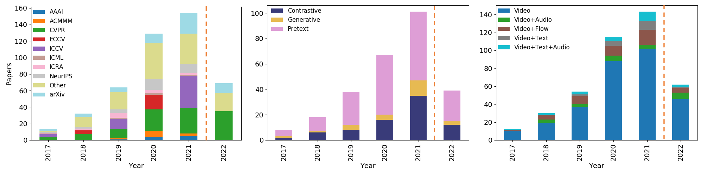
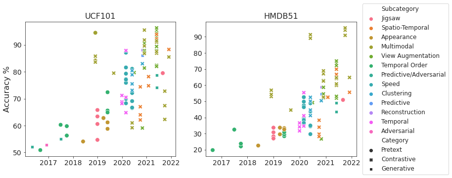

# SSL4VideoSurvey
A collection of works on self-supervised, deep-learning learning for video. The papers listed here refers to our survey:

[**Self-Supervised Learning for Videos: A Survey**](https://dl.acm.org/doi/abs/10.1145/3577925)

[*Madeline Chantry Schiappa*](https://www.linkedin.com/in/madelineschiappa/),
[*Yogesh Singh Rawat*](https://www.crcv.ucf.edu/person/rawat/),
[*Mubarak Shah*](https://www.crcv.ucf.edu/person/mubarak-shah/)

## Summary 
In this survey, we provide a review of existing approaches on self-supervised learning focusing on the video domain. We summarize these methods into four different categories based on their learning objectives: 1) *pretext tasks*, 2) *generative learning*, 3) *contrastive learning*, and 4) *cross-modal agreement*. We further introduce the commonly used datasets, downstream evaluation tasks, insights into the limitations of existing works, and the potential future directions in this area.


*Statistics of self-supervised (SSL) video representation learning research in recent years. From left to
right we show a) the total number of SSL related papers published in top conference venues, b) categorical
breakdown of the main research topics studied in SSL, and (c) modality breakdown of the main modalities
used in SSL. The year 2022 remains incomplete because a majority of the conferences occur later in the year.*


*Action recognition performance of models over time for different self-supervised strategies including
different modalities: video-only (V), video-text (V+T), video-audio (V+A), video-text-audio (V+T+A). More
recently, contrastive learning has become the most popular strategy.*

# Training Tasks
## Pre-Text Learning
### Action Recognition
*Downstream evaluation of action recognition on pretext self-supervised learning measured by
prediction accuracy. Top scores are in **bold**. Playback speed related tasks typically perform the best.*

| Model                                     | Subcategory                               | Visual Backbone | Pre-Train                    | UCF101            | HMDB51            |
|-------------------------------------------|-------------------------------------------|-----------------|------------------------------|-------------------|-------------------|
| [Geometry](https://ieeexplore.ieee.org/document/8578684)          | Appearance                                | AlexNet         | UCF101/HMDB51                | 54.10             | 22.60             |
| [Wang et al.](https://arxiv.org/abs/1904.03597)| Appearance                                | C3D             | UCF101                       | 61.20             | 33.40             |
| [3D RotNet](https://openaccess.thecvf.com/content_CVPR_2019/papers/Xu_Self-Supervised_Spatiotemporal_Learning_via_Video_Clip_Order_Prediction_CVPR_2019_paper.pdf)    | Appearance                                | 3D R-18         | [MT](https://pubmed.ncbi.nlm.nih.gov/30802849/) | 62.90             | 33.70             |
| [VideoJigsaw](https://ieeexplore.ieee.org/document/8659002)       | Jigsaw                                    | CaffeNet        | Kinetics                     | 54.70             | 27.00             |
| [3D ST-puzzle](https://dl.acm.org/doi/10.1609/aaai.v33i01.33018545) | Jigsaw                                    | C3D             | Kinetics                     | 65.80             | 33.70             |
| [CSJ](https://www.ijcai.org/proceedings/2021/104)                     | Jigsaw                                    | R(2+3)D         | Kinetics+UCF101+HMDB51       | 79.50             | <u>52.60</u> |
| [PRP](https://openaccess.thecvf.com/content_CVPR_2020/papers/Yao_Video_Playback_Rate_Perception_for_Self-Supervised_Spatio-Temporal_Representation_Learning_CVPR_2020_paper.pdf)                  | Speed                                     | R3D             | Kinetics                     | 72.10             | 35.00             |
| [SpeedNet](https://openaccess.thecvf.com/content_CVPR_2020/papers/Benaim_SpeedNet_Learning_the_Speediness_in_Videos_CVPR_2020_paper.pdf)         | Speed                                     | S3D-G           | Kinetics                     | 81.10             | 48.80             |
| [Jenni et al.](https://www.ecva.net/papers/eccv_2020/papers_ECCV/papers/123730426.pdf)        | Speed                                     | R(2+1)D         | UCF101                       | <u>87.10</u> | 49.80             |
| [PacePred](https://www.ecva.net/papers/eccv_2020/papers_ECCV/papers/123620494.pdf)         | Speed                                     | S3D-G           | UCF101                       | **87.10**    | **52.60**    |
| [ShuffleLearn](https://link.springer.com/chapter/10.1007/978-3-319-46448-0_32) | Temporal Order  | AlexNet                      | UCF101            | 50.90             | 19.80 |
| [OPN](https://openaccess.thecvf.com/content_ICCV_2017/papers/Lee_Unsupervised_Representation_Learning_ICCV_2017_paper.pdf)                   | Temporal Order                            | VGG-M           | UCF101                       | 59.80             | 23.80             |
| [O3N](https://openaccess.thecvf.com/content_cvpr_2017/papers/Fernando_Self-Supervised_Video_Representation_CVPR_2017_paper.pdf)            | Temporal Order                            | AlexNet         | UCF101                       | 60.30             | 32.50             |
| [ClipOrder](https://ieeexplore.ieee.org/document/8953292)         | Temporal Order                            | R3D             | UCF101                       | 72.40             | 30.90             |


### Video Retreival
*Performance for the downstream video retrieval task with top scores for each category in **bold**. K/U/H indicates using all three datasets for pre-training, i.e. Kinetics, UCF101, and HMDB51.*

| Model                            | Category     | Subcategory          | Visual Backbone | Pre-train           | UCF101 R@5 | HMDB51 R@5 |
|----------------------------------|--------------|----------------------|-----------------|---------------------|-----------|-----------|
| [SpeedNet](https://openaccess.thecvf.com/content_CVPR_2020/papers/Benaim_SpeedNet_Learning_the_Speediness_in_Videos_CVPR_2020_paper.pdf)   | Pretext      | Speed                | S3D-G           | Kinetics            | 28.10     | --        |
| [ClipOrder](https://ieeexplore.ieee.org/document/8953292)     | Pretext      | Temporal Order       | R3D             | UCF101              | 30.30     | 22.90     |
| [OPN](https://openaccess.thecvf.com/content_ICCV_2017/papers/Lee_Unsupervised_Representation_Learning_ICCV_2017_paper.pdf)          | Pretext      | Temporal Order       | CaffeNet        | UCF101              | 28.70     | --        |
| [CSJ](https://www.ijcai.org/proceedings/2021/104)              | Pretext      | Jigsaw               | R(2+3)D         | K/U/H               | 40.50     | --        |
| [PRP](https://openaccess.thecvf.com/content_CVPR_2020/papers/Yao_Video_Playback_Rate_Perception_for_Self-Supervised_Spatio-Temporal_Representation_Learning_CVPR_2020_paper.pdf)          | Pretext      | Speed                | R3D             | Kinetics            | 38.50     | 27.20     |
| [Jenni et al.](https://www.ecva.net/papers/eccv_2020/papers_ECCV/papers/123730426.pdf)| Pretext      | Speed                | 3D R-18         | Kinetics            | 48.50     | --        |
| [PacePred](https://www.ecva.net/papers/eccv_2020/papers_ECCV/papers/123620494.pdf)  | Pretext      | Speed                | R(2+1)D         | UCF101              | **49.70**     | **32.20**     |

## Generative Learning
### Action Recognition
*Downstream action recognition evaluation for models that use a generative self-supervised pre-training approach. Top scores are in **bold***
| Model                              | Subcategory       | Visual Backbone         | Pre-train        | UCF101 | HMDB51 |
|------------------------------------|-------------------|-------------------------|------------------|--------|--------|
| [pSwaV](https://openaccess.thecvf.com/content/CVPR2021/papers/Feichtenhofer_A_Large-Scale_Study_on_Unsupervised_Spatiotemporal_Representation_Learning_CVPR_2021_paper.pdf)          | Contrastive  | View Aug.   | [R-50](https://arxiv.org/abs/1512.03385)                | Kinetics                            | 51.7 | 62.7     |
| [pSimCLR](https://openaccess.thecvf.com/content/CVPR2021/papers/Feichtenhofer_A_Large-Scale_Study_on_Unsupervised_Spatiotemporal_Representation_Learning_CVPR_2021_paper.pdf)      | Contrastive  | View Aug.   | [R-50](https://arxiv.org/abs/1512.03385)                | Kinetics                            | 52.0 | 62.0     |
| [pMoCo](https://openaccess.thecvf.com/content/CVPR2021/papers/Feichtenhofer_A_Large-Scale_Study_on_Unsupervised_Spatiotemporal_Representation_Learning_CVPR_2021_paper.pdf)         | Contrastive  | View Aug.   | [R-50](https://arxiv.org/abs/1512.03385)                | Kinetics                            | 54.4 | 69.0     |
| [pBYOL](https://openaccess.thecvf.com/content/CVPR2021/papers/Feichtenhofer_A_Large-Scale_Study_on_Unsupervised_Spatiotemporal_Representation_Learning_CVPR_2021_paper.pdf)          | Contrastive  | View Aug.   | [R-50](https://arxiv.org/abs/1512.03385)                | Kinetics                            | **55.8** | **71.5**     |
| [Mathieu et al.](https://arxiv.org/abs/1511.05440)  | Frame Prediction  | C3D                     | Sports1M          | 52.10  | --     |
| [VideoGan](https://dl.acm.org/doi/pdf/10.5555/3157096.3157165) | Reconstruction    | VAE                     | Flickr            | 52.90  | --     |
| [Liang et al.](https://openaccess.thecvf.com/content_ICCV_2017/papers/Liang_Dual_Motion_GAN_ICCV_2017_paper.pdf)          | Frame Prediction  | LSTM                    | UCF101            | 55.10  | --     |
| [VideoMoCo](https://openaccess.thecvf.com/content/CVPR2021/papers/Pan_VideoMoCo_Contrastive_Video_Representation_Learning_With_Temporally_Adversarial_Examples_CVPR_2021_paper.pdf)          | Frame Prediction  | R(2+1)D                 | Kinetics          | 78.70  | 49.20  |
| [MemDPC-Dual](https://www.ecva.net/papers/eccv_2020/papers_ECCV/papers/123480324.pdf)             | Frame Prediction  | R(2+3)D                 | Kinetics          | 86.10  | 54.50  |
| [Tian et al.](https://www.ecva.net/papers/eccv_2020/papers_ECCV/papers/123590069.pdf)          | Reconstruction    | 3D R-101                | Kinetics          | 88.10  | 59.00  |
| [VideoMAE](https://arxiv.org/abs/2203.12602)     | [MAE](https://arxiv.org/abs/2205.09113)               | [ViT-L](https://arxiv.org/abs/2010.11929) | ImageNet  | 91.3   | 62.6   |
| [MotionMAE](https://arxiv.org/abs/2210.04154)          | [MAE](https://arxiv.org/abs/2205.09113)               | [ViT-B](https://arxiv.org/abs/2010.11929) | Kinetics  | 96.3   | --     |


*Downstream evaluation of action recognition on  self-supervised learning measured by prediction accuracy for [Something-Something (SS)](https://developer.qualcomm.com/software/ai-datasets/something-something) and [Kinetics400 (Kinetics)](https://www.deepmind.com/open-source/kinetics). SS is a more temporally relevant dataset and therefore is more challenging.  Top scores for each category are in **bold** and second best scores \underline{underlined}.*

| Model                                          | Category     | Subcategory | Visual Backbone      | Pre-Train                           | SS   | Kinetics |
|-----------------------------------------------|--------------|-------------|---------------------|-------------------------------------|------|----------|
| [BEVT](https://openaccess.thecvf.com/content/CVPR2022/papers/Wang_BEVT_BERT_Pretraining_of_Video_Transformers_CVPR_2022_paper.pdf)                   | Generative   | [MAE](https://arxiv.org/abs/2205.09113)         | [SWIN-B](https://openaccess.thecvf.com/content/ICCV2021/papers/Liu_Swin_Transformer_Hierarchical_Vision_Transformer_Using_Shifted_Windows_ICCV_2021_paper.pdf)      | Kinetics+[ImageNet](https://proceedings.neurips.cc/paper_files/paper/2012/file/c399862d3b9d6b76c8436e924a68c45b-Paper.pdf) | 71.4 | 81.1     |
| [MAE](https://arxiv.org/abs/2205.09113)           | Generative   | [MAE](https://arxiv.org/abs/2205.09113)         | [ViT-H](https://arxiv.org/abs/2010.11929)    | Kinetics                            | 74.1 | 81.1     |
| [MaskFeat](https://openaccess.thecvf.com/content/CVPR2022/papers/Wei_Masked_Feature_Prediction_for_Self-Supervised_Visual_Pre-Training_CVPR_2022_paper.pdf)                | Generative   |  [MAE](https://arxiv.org/abs/2205.09113)         | [MViT](https://openaccess.thecvf.com/content/ICCV2021/papers/Fan_Multiscale_Vision_Transformers_ICCV_2021_paper.pdf)       | Kinetics                            | 74.4 | **86.7**     |
| [VideoMAE](https://arxiv.org/abs/2203.12602)              | Generative   |  [MAE](https://arxiv.org/abs/2205.09113)         | [ViT-L](https://arxiv.org/abs/2010.11929)      | ImageNet                            | 75.3 | 85.1     |
| [MotionMAE](https://arxiv.org/abs/2210.04154)                     | Generative   |  [MAE](https://arxiv.org/abs/2205.09113)         | [ViT-B](https://arxiv.org/abs/2010.11929)     | Kinetics                            | **75.5** | 81.7     |

### Video Retreival
*Performance for the downstream video retrieval task with top scores for each category in **bold**. K/U/H indicates using all three datasets for pre-training, i.e. Kinetics, UCF101, and HMDB51.*
| Model                            | Category     | Subcategory          | Visual Backbone | Pre-train           | UCF101 R@5 | HMDB51 R@5 |
|----------------------------------|--------------|----------------------|-----------------|---------------------|-----------|-----------|
| [MemDPC-RGP](https://www.ecva.net/papers/eccv_2020/papers_ECCV/papers/123480324.pdf)         | Generative   | Frame Prediction     | R(2+3)D         | Kinetics            | 40.40     | 25.70     |
| [MemDPC-Flow](https://www.ecva.net/papers/eccv_2020/papers_ECCV/papers/123480324.pdf)         | Generative   | Frame Prediction     | R(2+3)D         | Kinetics            | **63.20**     | **37.60**     |
## Text-to-Video Retrieval 
*Performance for the downstream video retrieval task. Top scores for each category are in **bold**. Masked Modeling (MM) is a generative approach that uses both video with text. Cross-modal agreement include a variety of contrastive approaches that can use video with audio and/or text. Cross-modal agreement pre-training approaches typically perform best. Some models have dedicated variations in what they report with fine-tuning (*) on the target dataset, [YouCook2](http://youcook2.eecs.umich.edu) or [MSRVTT](https://www.microsoft.com/en-us/research/publication/msr-vtt-a-large-video-description-dataset-for-bridging-video-and-language/). The pre-training datasets titled COMBO are [CC3M](https://aclanthology.org/P18-1238/), [WV-2M](https://arxiv.org/abs/2104.00650) and [COCO](https://cocodataset.org/#home).*
| Model                                      | Visual    | Text        | Pre-Train          | R@5 YouCook2   | R@5 MSRVTT   |
|--------------------------------------------|-----------|-------------|--------------------|---------------|--------------|
| [ActBERT](https://openaccess.thecvf.com/content_CVPR_2020/papers/Zhu_ActBERT_Learning_Global-Local_Video-Text_Representations_CVPR_2020_paper.pdf)                      | 3D R-32   | BERT        | Kinetics+How2      | 26.70         | 23.40        |
| [HERO](https://aclanthology.org/2020.emnlp-main.161/)                         | SlowFast  | WordPieces  | How2+[TV](https://arxiv.org/abs/1604.06506)  | --            | 43.40        |
| [ClipBERT](https://openaccess.thecvf.com/content/CVPR2021/papers/Lei_Less_Is_More_ClipBERT_for_Video-and-Language_Learning_via_Sparse_Sampling_CVPR_2021_paper.pdf)                    | R-50      | WordPieces  | [VisualGenome](https://arxiv.org/abs/1602.07332)  | --            | 46.80        |
| [VLM](https://aclanthology.org/2021.findings-acl.370/)                         | S3D-g     | BERT        | How2               | 56.88         | 55.50        |
| [UniVL](https://arxiv.org/abs/2002.06353)                     | S3D-g     | BERT        | How2               | 57.60         | 49.60        |
| [Amrani et al.](https://arxiv.org/abs/2003.03186)           | R-152     | Word2Vec    | How2               | --            | 21.30        |

## Video Captioning
*Downstream evaluation for video captioning on the YouCook2 dataset for video-language models. Top scores are in **bold**. MM: Masked modeling with video and text, and K/H: Kinetics+HowTo100M.*

| Model                | Category      | Subcategory   | Visual | Text  | Pre-train  | BLEU4  | METEOR   | ROUGE   | CIDEr  |
|----------------------|---------------|---------------|--------|-------|------------|--------|----------|---------|--------|
| [VideoBert](https://openaccess.thecvf.com/content_ICCV_2019/papers/Sun_VideoBERT_A_Joint_Model_for_Video_and_Language_Representation_Learning_ICCV_2019_paper.pdf)| Generative | MM            | S3D-g  | BERT  | Kinetics   | 4.33   | 11.94    | 28.80   | 0.55   |
| [ActBERT](https://openaccess.thecvf.com/content_CVPR_2020/papers/Zhu_ActBERT_Learning_Global-Local_Video-Text_Representations_CVPR_2020_paper.pdf)     | Generative | MM            | 3D R-32| BERT  | K/H        | 5.41   | 13.30    | 30.56   | 0.65   |
| [VLM](https://aclanthology.org/2021.findings-acl.370/)    | Generative | MM            | S3D-g  | BERT  | How2       | 12.27  | 18.22    | 41.51   | 1.39   |
| [UniVL](https://arxiv.org/abs/2002.06353)  | Generative | MM            | S3D-g  | BERT  | How2       | 17.35  | 22.35    | 46.52   | 1.81   |

## Contrastive Learning
### Action Recognition
*Downstream evaluation of action recognition on  self-supervised learning measured by prediction accuracy for [Something-Something (SS)](https://developer.qualcomm.com/software/ai-datasets/something-something) and [Kinetics400 (Kinetics)](https://www.deepmind.com/open-source/kinetics). SS is a more temporally relevant dataset and therefore is more challenging.  Top scores for each category are in **bold** and second best scores \underline{underlined}.*

| Model                                          | Category     | Subcategory | Visual Backbone      | Pre-Train                           | SS   | Kinetics |
|-----------------------------------------------|--------------|-------------|---------------------|-------------------------------------|------|----------|
| [pSwaV](https://openaccess.thecvf.com/content/CVPR2021/papers/Feichtenhofer_A_Large-Scale_Study_on_Unsupervised_Spatiotemporal_Representation_Learning_CVPR_2021_paper.pdf)          | Contrastive  | View Aug.   | [R-50](https://arxiv.org/abs/1512.03385)                | Kinetics                            | 51.7 | 62.7     |
| [pSimCLR](https://openaccess.thecvf.com/content/CVPR2021/papers/Feichtenhofer_A_Large-Scale_Study_on_Unsupervised_Spatiotemporal_Representation_Learning_CVPR_2021_paper.pdf)      | Contrastive  | View Aug.   | [R-50](https://arxiv.org/abs/1512.03385)                | Kinetics                            | 52.0 | 62.0     |
| [pMoCo](https://openaccess.thecvf.com/content/CVPR2021/papers/Feichtenhofer_A_Large-Scale_Study_on_Unsupervised_Spatiotemporal_Representation_Learning_CVPR_2021_paper.pdf)         | Contrastive  | View Aug.   | [R-50](https://arxiv.org/abs/1512.03385)                | Kinetics                            | 54.4 | 69.0     |
| [pBYOL](https://openaccess.thecvf.com/content/CVPR2021/papers/Feichtenhofer_A_Large-Scale_Study_on_Unsupervised_Spatiotemporal_Representation_Learning_CVPR_2021_paper.pdf)          | Contrastive  | View Aug.   | [R-50](https://arxiv.org/abs/1512.03385)                | Kinetics                            | **55.8** | **71.5**     |

## Contrastive

### Action Recognition 
*Downstream action recognition on UCF101 and HMDB51 for models that use contrastive learning and/or cross-modal agreement. Top scores for each category are in **bold**. Modalities include video (V), optical flow (F), human keypoints (K), text (T) and audio (A). Spatio-temporal augmentations with contrastive learning typically are the highest performing approaches.*

| Model                                      | Subcategory       | Visual    | Modalities    | Pre-Train         | UCF101   | HMDB51   |
|--------------------------------------------|-------------------|-----------|---------------|-------------------|----------|----------|
| [VIE](https://openaccess.thecvf.com/content_CVPR_2020/papers/Zhuang_Unsupervised_Learning_From_Video_With_Deep_Neural_Embeddings_CVPR_2020_paper.pdf)                | Clustering        | Slowfast  | V             | Kinetics          | 78.90    | 50.1     |
| [VIE-2pathway](https://openaccess.thecvf.com/content_CVPR_2020/papers/Zhuang_Unsupervised_Learning_From_Video_With_Deep_Neural_Embeddings_CVPR_2020_paper.pdf)        | Clustering        | R-18      | V             | Kinetics          | 80.40    | 52.5     |
| [Tokmakov et al.](https://dl.acm.org/doi/10.1007/978-3-030-66096-3_28) | Clustering   | 3D R-18   | V             | Kinetics          | 83.00    | 50.4     |
| [TCE](https://www.computer.org/csdl/proceedings-article/icpr/2021/09412071/1tmjbCfCuu4)               | Temporal Aug.     | R-50      | V             | UCF101            | 71.20    | 36.6     |
| [Lorre et al.](https://openaccess.thecvf.com/content_WACV_2020/papers/LORRE_Temporal_Contrastive_Pretraining_for_Video_Action_Recognition_WACV_2020_paper.pdf)              | Temporal Aug.     | R-18      | V+F           | UCF101            | 87.90    | 55.4     |
| [CMC-Dual](https://www.ecva.net/papers/eccv_2020/papers_ECCV/papers/123560749.pdf)               | Spatial Aug.      | CaffeNet  | V+F           | UCF101            | 59.10    | 26.7     |
| [SwAV](https://openaccess.thecvf.com/content/CVPR2021/papers/Feichtenhofer_A_Large-Scale_Study_on_Unsupervised_Spatiotemporal_Representation_Learning_CVPR_2021_paper.pdf)        | Spatial Aug.      | R-50      | V             | Kinetics          | 74.70    | --       |
| [VDIM](https://arxiv.org/abs/2007.13278)                   | Spatial Aug.      | R(2+1)D   | V             | Kinetics          | 79.70    | 49.2     |
| [CoCon](https://openaccess.thecvf.com/content/CVPR2021W/HVU/papers/Rai_CoCon_Cooperative-Contrastive_Learning_CVPRW_2021_paper.pdf)              | Spatial Aug.      | R-34      | V+F+K         | UCF101            | 82.40    | 53.1     |
| [SimCLR](https://openaccess.thecvf.com/content/CVPR2021/papers/Feichtenhofer_A_Large-Scale_Study_on_Unsupervised_Spatiotemporal_Representation_Learning_CVPR_2021_paper.pdf)      | Spatial Aug.      | R-50      | V             | Kinetics          | 84.20    | --       |
| [CoCLR](https://proceedings.neurips.cc/paper/2020/file/3def184ad8f4755ff269862ea77393dd-Paper.pdf)            | Spatial Aug.      | S3D-G     | V+F           | UCF101            | 90.60    | 62.9     |
| [MoCo](https://openaccess.thecvf.com/content/CVPR2021/papers/Feichtenhofer_A_Large-Scale_Study_on_Unsupervised_Spatiotemporal_Representation_Learning_CVPR_2021_paper.pdf)   | Spatial Aug.      | R-50      | V             | Kinetics          | 90.80    | --       |
| [BYOL](https://openaccess.thecvf.com/content/CVPR2021/papers/Feichtenhofer_A_Large-Scale_Study_on_Unsupervised_Spatiotemporal_Representation_Learning_CVPR_2021_paper.pdf)        | Spatial Aug.      | R-50      | V             | Kinetics          | 91.20    | --       |
| [DVIM](https://arxiv.org/abs/2109.12493)                     | Spatio-Temporal Aug. | R-18   | V+F           | UCF101            | 64.00    | 29.7     |
| [IIC](https://dl.acm.org/doi/10.1145/3394171.3413694)                         | Spatio-Temporal Aug. | R3D      | V+F           | Kinetics          | 74.40    | 38.3     |
| [DSM](https://arxiv.org/abs/2009.05757)                  | Spatio-Temporal Aug. | I3D      | V             | Kinetics          | 78.20    | 52.8     |
| [pSimCLR](https://dl.acm.org/doi/abs/10.5555/3524938.3525087)             | Spatio-Temporal Aug. | R-50      | V             | Kinetics          | 87.90    | --       |
| [TCLR](https://arxiv.org/abs/2101.07974)             | Spatio-Temporal Aug. | R(2+1)D   | V             | UCF101            | 88.20    | 60.0     |
| [SeCo](https://arxiv.org/abs/2008.00975)                       | Spatio-Temporal Aug. | R-50      | V             | ImageNet| 88.30    | 55.6     |
| [pSwaV](https://proceedings.neurips.cc/paper/2020/file/70feb62b69f16e0238f741fab228fec2-Paper.pdf)         | Spatio-Temporal Aug. | R-50      | V             | Kinetics          | 89.40    | --       |
| [pBYOL](https://dl.acm.org/doi/abs/10.5555/3495724.3497510)            | Spatio-Temporal Aug. | R-50      | V             | Kinetics          | 93.80    | --       |
| [CVRL](https://www.computer.org/csdl/proceedings-article/cvpr/2021/450900g960/1yeL2kcwn9S)                     | Spatio-Temporal Aug. | 3D R-50   | V             | Kinetics          | 93

## Cross-Modal Learning
### Text-to-Video Retrieval 
*Performance for the downstream video retrieval task. Top scores for each category are in **bold**. Masked Modeling (MM) is a generative approach that uses both video with text. Cross-modal agreement include a variety of contrastive approaches that can use video with audio and/or text. Cross-modal agreement pre-training approaches typically perform best. Some models have dedicated variations in what they report with fine-tuning (*) on the target dataset, [YouCook2](http://youcook2.eecs.umich.edu) or [MSRVTT](https://www.microsoft.com/en-us/research/publication/msr-vtt-a-large-video-description-dataset-for-bridging-video-and-language/). The pre-training datasets titled COMBO are [CC3M](https://aclanthology.org/P18-1238/), [WV-2M](https://arxiv.org/abs/2104.00650) and [COCO](https://cocodataset.org/#home).*
| Model                                      | Visual    | Text        | Pre-Train          | R@5 YouCook2   | R@5 MSRVTT   |
|--------------------------------------------|-----------|-------------|--------------------|---------------|--------------|
| [ActBERT](https://openaccess.thecvf.com/content_CVPR_2020/papers/Zhu_ActBERT_Learning_Global-Local_Video-Text_Representations_CVPR_2020_paper.pdf)                      | 3D R-32   | BERT        | Kinetics+How2      | 26.70         | 23.40        |
| [HERO](https://aclanthology.org/2020.emnlp-main.161/)                         | SlowFast  | WordPieces  | How2+[TV](https://arxiv.org/abs/1604.06506)  | --            | 43.40        |
| [ClipBERT](https://openaccess.thecvf.com/content/CVPR2021/papers/Lei_Less_Is_More_ClipBERT_for_Video-and-Language_Learning_via_Sparse_Sampling_CVPR_2021_paper.pdf)                    | R-50      | WordPieces  | [VisualGenome](https://arxiv.org/abs/1602.07332)  | --            | 46.80        |
| [VLM](https://aclanthology.org/2021.findings-acl.370/)                         | S3D-g     | BERT        | How2               | 56.88         | 55.50        |
| [UniVL](https://arxiv.org/abs/2002.06353)                     | S3D-g     | BERT        | How2               | 57.60         | 49.60        |
| [Amrani et al.](https://arxiv.org/abs/2003.03186)           | R-152     | Word2Vec    | How2               | --            | 21.30        |
| [MIL-NCE](https://openaccess.thecvf.com/content_CVPR_2020/papers/Miech_End-to-End_Learning_of_Visual_Representations_From_Uncurated_Instructional_Videos_CVPR_2020_paper.pdf)                   | S3D       | Word2Vec    | How2               | 38.00         | 24.00        |
| [COOT](https://dl.acm.org/doi/10.5555/3495724.3497619)                           | S3D-g     | BERT        | How2+YouCook2      | 40.20         | --           |
| [CE](https://arxiv.org/abs/1907.13487)*                      | Experts   | [NetVLAD](https://openaccess.thecvf.com/content_cvpr_2016/papers/Arandjelovic_NetVLAD_CNN_Architecture_CVPR_2016_paper.pdf) | MSRVTT             | --            | 29.00        |
| [VideoClip](https://aclanthology.org/2021.emnlp-main.544/)    | S3D-g     | BERT        | How2               | 50.40         | 22.20        |
| [VATT](https://arxiv.org/abs/2104.11178)              | Linear Proj. | Linear Proj. | AS+How2          | --            | --           |
| [MEE](https://arxiv.org/abs/1804.02516)           | Experts   | [NetVLAD](https://openaccess.thecvf.com/content_cvpr_2016/papers/Arandjelovic_NetVLAD_CNN_Architecture_CVPR_2016_paper.pdf)  | [COCO](https://cocodataset.org/#home) | --       | 39.20        |
| [JPoSE](https://openaccess.thecvf.com/content_ICCV_2019/papers/Wray_Fine-Grained_Action_Retrieval_Through_Multiple_Parts-of-Speech_Embeddings_ICCV_2019_paper.pdf)                     | [TSN](https://link.springer.com/chapter/10.1007/978-3-319-46484-8_2) | Word2Vec  | Kinetics         | --            | 38.10        |
| [Amrani et al.](https://arxiv.org/abs/2003.03186)*            | R-152     | Word2Vec    | How2               | --            | 41.60        |
| [AVLnet](https://arxiv.org/abs/2006.09199)*           | 3D R-101  | Word2Vec    | How2               | 55.50         | 50.50        |
| [MMT](https://www.ecva.net/papers/eccv_2020/papers_ECCV/papers/123490205.pdf)                    | Experts   | BERT        | How2               | --            | 14.40        |
| [MMT](https://www.ecva.net/papers/eccv_2020/papers_ECCV/papers/123490205.pdf)*                      | Experts   | BERT        | How2               | --            | 55.70        |
| [Patrick et al.](https://arxiv.org/abs/2010.02824)*  | Experts   | [T-5](https://arxiv.org/abs/1910.10683)  | How2        | 58.50         | --           |
| [VideoClip](https://aclanthology.org/2021.emnlp-main.544/)*    | S3D-g     | BERT        | How2               | **62.60**         | 55.40        |
| [FIT](https://arxiv.org/abs/2104.00650)                        | ViT | BERT | COMBO       | --         | **61.50**            |


### Video Captioning
*Downstream evaluation for video captioning on the YouCook2 dataset for video-language models. Top scores are in **bold**. MM: Masked modeling with video and text, and K/H: Kinetics+HowTo100M.*

| Model                | Category      | Subcategory   | Visual | Text  | Pre-train  | BLEU4  | METEOR   | ROUGE   | CIDEr  |
|----------------------|---------------|---------------|--------|-------|------------|--------|----------|---------|--------|
| [CBT](https://arxiv.org/abs/1906.05743)  | Cross-Modal   | Video+Text    | S3D-G  | BERT  | Kinetics   | 5.12   | 12.97    | 30.44   | 0.64   |
| [COOT](https://dl.acm.org/doi/10.5555/3495724.3497619)     | Cross-Modal   | Video+Text    | S3D-g  | BERT  | YouCook2   | 11.30  | 19.85    | 37.94   | --     |
| [VideoBert](https://openaccess.thecvf.com/content_ICCV_2019/papers/Sun_VideoBERT_A_Joint_Model_for_Video_and_Language_Representation_Learning_ICCV_2019_paper.pdf)| Generative | MM            | S3D-g  | BERT  | Kinetics   | 4.33   | 11.94    | 28.80   | 0.55   |
| [ActBERT](https://openaccess.thecvf.com/content_CVPR_2020/papers/Zhu_ActBERT_Learning_Global-Local_Video-Text_Representations_CVPR_2020_paper.pdf)     | Generative | MM            | 3D R-32| BERT  | K/H        | 5.41   | 13.30    | 30.56   | 0.65   |
| [VLM](https://aclanthology.org/2021.findings-acl.370/)    | Generative | MM            | S3D-g  | BERT  | How2       | 12.27  | 18.22    | 41.51   | 1.39   |
| [UniVL](https://arxiv.org/abs/2002.06353)  | Generative | MM            | S3D-g  | BERT  | How2       | 17.35  | 22.35    | 46.52   | 1.81   |

### Action Segmentation
*Downstream action segmentation evaluation on COIN for models that use a cross-modal agreement self-supervised pre-training approach. The top score is in **bold**.*
| Model                                    | Visual   | Text      | Pre-train       | Frame-Acc        |
|------------------------------------------|----------|-----------|-----------------|------------------|
| [CBT](https://arxiv.org/abs/1906.05743)                      | S3D-G    | BERT      | Kinetics+How2   | 53.90            |
| [ActBERT](https://openaccess.thecvf.com/content_CVPR_2020/papers/Zhu_ActBERT_Learning_Global-Local_Video-Text_Representations_CVPR_2020_paper.pdf)                   | 3D R-32  | BERT      | Kinetics+How2   | 56.95            |
| [VideoClip](https://aclanthology.org/2021.emnlp-main.544/) (zs) | S3D-g  | BERT      | How2            | 58.90            |
| [MIL-NCE](https://openaccess.thecvf.com/content_CVPR_2020/papers/Miech_End-to-End_Learning_of_Visual_Representations_From_Uncurated_Instructional_Videos_CVPR_2020_paper.pdf)       | S3D      | Word2Vec  | How2            | 61.00            |
| [VLM](https://aclanthology.org/2021.findings-acl.370/)                         | S3D-g    | BERT      | How2            | 68.39            |
| [VideoClip](https://aclanthology.org/2021.emnlp-main.544/) (ft) | S3D-g  | BERT      | How2            | 68.70 |
| [UniVL](https://arxiv.org/abs/2002.06353)                     | S3D-g    | BERT      | How2            | 70.20   |

### Temporal Action Step Localization
*Downstream temporal action step localization evaluation on CrossTask for models that use a contrastive multimodal self-supervised pre-training approach. Top scores are in **bold**.*


| Model                                        | Visual                       | Text     | Pre-train     | Recall            |
|----------------------------------------------|------------------------------|----------|---------------|-------------------|
| [VideoClip](https://aclanthology.org/2021.emnlp-main.544/) (zs) | S3D-g                        | BERT     | How2          | 33.90             |
| [MIL-NCE](https://openaccess.thecvf.com/content_CVPR_2020/papers/Miech_End-to-End_Learning_of_Visual_Representations_From_Uncurated_Instructional_Videos_CVPR_2020_paper.pdf)                   | S3D                          | Word2Vec | How2          | 40.50             |
| [ActBERT](https://openaccess.thecvf.com/content_CVPR_2020/papers/Zhu_ActBERT_Learning_Global-Local_Video-Text_Representations_CVPR_2020_paper.pdf)                       | 3D R-32                      | BERT     | Kinetics+How2 | 41.40             |
| [UniVL](https://arxiv.org/abs/2002.06353)                        | S3D-g                        | BERT     | How2          | 42.00             |
| [VLM](https://aclanthology.org/2021.findings-acl.370/)                            | S3D-g                        | BERT     | How2          | 46.50 |
| [VideoClip](https://aclanthology.org/2021.emnlp-main.544/) (ft) | S3D-g                        | BERT     | How2          | **47.30**    |


# Evaluation Tasks
## Action Recognition 
*Downstream action recognition on UCF101 and HMDB51 for models that use contrastive learning and/or cross-modal agreement. Top scores for each category are in **bold**. Modalities include video (V), optical flow (F), human keypoints (K), text (T) and audio (A). Spatio-temporal augmentations with contrastive learning typically are the highest performing approaches.*

| Model                                      | Subcategory       | Visual    | Modalities    | Pre-Train         | UCF101   | HMDB51   |
|--------------------------------------------|-------------------|-----------|---------------|-------------------|----------|----------|
| [Geometry](https://ieeexplore.ieee.org/document/8578684)               | Appearance       | AlexNet         | V          | UCF101/HMDB51             | 54.10    | 22.60    |
| [Wang et al.](https://arxiv.org/abs/1904.03597)      | Appearance       | C3D             | V          | UCF101                    | 61.20    | 33.40    |
| [3D RotNet](https://openaccess.thecvf.com/content_CVPR_2019/papers/Xu_Self-Supervised_Spatiotemporal_Learning_via_Video_Clip_Order_Prediction_CVPR_2019_paper.pdf)       | Appearance       | 3D R-18         | V          | [MT](https://pubmed.ncbi.nlm.nih.gov/30802849/) | 62.90    | 33.70    |
| [VideoJigsaw](https://ieeexplore.ieee.org/document/8659002)       | Jigsaw                                    | CaffeNet        | Kinetics                     | 54.70             | 27.00             |              | Jigsaw           | CaffeNet        | V          | Kinetics                  | 54.70    | 27.00    |
| [3D ST-puzzle](https://dl.acm.org/doi/10.1609/aaai.v33i01.33018545)    | Jigsaw           | C3D             | V          | Kinetics                  | 65.80    | 33.70    |
| [CSJ](https://www.ijcai.org/proceedings/2021/104)                          | Jigsaw           | R(2+3)D         | V          | Kinetics+UCF101+HMDB51     | 79.50    | 52.60    |
| [PRP](https://openaccess.thecvf.com/content_CVPR_2020/papers/Yao_Video_Playback_Rate_Perception_for_Self-Supervised_Spatio-Temporal_Representation_Learning_CVPR_2020_paper.pdf)                       | Speed            | R3D             | V          | Kinetics                  | 72.10    | 35.00    |
| [SpeedNet](https://openaccess.thecvf.com/content_CVPR_2020/papers/Benaim_SpeedNet_Learning_the_Speediness_in_Videos_CVPR_2020_paper.pdf)              | Speed            | S3D-G           | V          | Kinetics                  | 81.10    | 48.80    |
| [Jenni et al.](https://www.ecva.net/papers/eccv_2020/papers_ECCV/papers/123730426.pdf)            | Speed            | R(2+1)D         | V          | UCF101                    | 87.10    | 49.80    |
| [PacePred](https://www.ecva.net/papers/eccv_2020/papers_ECCV/papers/123620494.pdf)               | Speed            | S3D-G           | V          | UCF101                    | 87.10    | 52.60    |
| [ShuffleLearn](https://link.springer.com/chapter/10.1007/978-3-319-46448-0_32) | Temporal Order | AlexNet         | V          | UCF101                    | 50.90    | 19.80    |
| [OPN](https://openaccess.thecvf.com/content_ICCV_2017/papers/Lee_Unsupervised_Representation_Learning_ICCV_2017_paper.pdf)                      | Temporal Order   | VGG-M           | V          | UCF101                    | 59.80    | 23.80    |
| [O3N](https://openaccess.thecvf.com/content_cvpr_2017/papers/Fernando_Self-Supervised_Video_Representation_CVPR_2017_paper.pdf)      | Temporal Order   | AlexNet         | V          | UCF101                    | 60.30    | 32.50    |
| [ClipOrder](https://ieeexplore.ieee.org/document/8953292)                  | Temporal Order   | R3D             | V          | UCF101                    | 72.40    | 30.90    |
| [VIE](https://openaccess.thecvf.com/content_CVPR_2020/papers/Zhuang_Unsupervised_Learning_From_Video_With_Deep_Neural_Embeddings_CVPR_2020_paper.pdf)                | Clustering        | Slowfast  | V             | Kinetics          | 78.90    | 50.1     |
| [VIE-2pathway](https://openaccess.thecvf.com/content_CVPR_2020/papers/Zhuang_Unsupervised_Learning_From_Video_With_Deep_Neural_Embeddings_CVPR_2020_paper.pdf)        | Clustering        | R-18      | V             | Kinetics          | 80.40    | 52.5     |
| [Tokmakov et al.](https://dl.acm.org/doi/10.1007/978-3-030-66096-3_28) | Clustering   | 3D R-18   | V             | Kinetics          | 83.00    | 50.4     |
| [TCE](https://www.computer.org/csdl/proceedings-article/icpr/2021/09412071/1tmjbCfCuu4)               | Temporal Aug.     | R-50      | V             | UCF101            | 71.20    | 36.6     |
| [Lorre et al.](https://openaccess.thecvf.com/content_WACV_2020/papers/LORRE_Temporal_Contrastive_Pretraining_for_Video_Action_Recognition_WACV_2020_paper.pdf)              | Temporal Aug.     | R-18      | V+F           | UCF101            | 87.90    | 55.4     |
| [CMC-Dual](https://www.ecva.net/papers/eccv_2020/papers_ECCV/papers/123560749.pdf)               | Spatial Aug.      | CaffeNet  | V+F           | UCF101            | 59.10    | 26.7     |
| [SwAV](https://openaccess.thecvf.com/content/CVPR2021/papers/Feichtenhofer_A_Large-Scale_Study_on_Unsupervised_Spatiotemporal_Representation_Learning_CVPR_2021_paper.pdf)        | Spatial Aug.      | R-50      | V             | Kinetics          | 74.70    | --       |
| [VDIM](https://arxiv.org/abs/2007.13278)                   | Spatial Aug.      | R(2+1)D   | V             | Kinetics          | 79.70    | 49.2     |
| [CoCon](https://openaccess.thecvf.com/content/CVPR2021W/HVU/papers/Rai_CoCon_Cooperative-Contrastive_Learning_CVPRW_2021_paper.pdf)              | Spatial Aug.      | R-34      | V+F+K         | UCF101            | 82.40    | 53.1     |
| [SimCLR](https://openaccess.thecvf.com/content/CVPR2021/papers/Feichtenhofer_A_Large-Scale_Study_on_Unsupervised_Spatiotemporal_Representation_Learning_CVPR_2021_paper.pdf)      | Spatial Aug.      | R-50      | V             | Kinetics          | 84.20    | --       |
| [CoCLR](https://proceedings.neurips.cc/paper/2020/file/3def184ad8f4755ff269862ea77393dd-Paper.pdf)            | Spatial Aug.      | S3D-G     | V+F           | UCF101            | 90.60    | 62.9     |
| [MoCo](https://openaccess.thecvf.com/content/CVPR2021/papers/Feichtenhofer_A_Large-Scale_Study_on_Unsupervised_Spatiotemporal_Representation_Learning_CVPR_2021_paper.pdf)   | Spatial Aug.      | R-50      | V             | Kinetics          | 90.80    | --       |
| [BYOL](https://openaccess.thecvf.com/content/CVPR2021/papers/Feichtenhofer_A_Large-Scale_Study_on_Unsupervised_Spatiotemporal_Representation_Learning_CVPR_2021_paper.pdf)        | Spatial Aug.      | R-50      | V             | Kinetics          | 91.20    | --       |
| [MIL-NCE](https://openaccess.thecvf.com/content_CVPR_2020/papers/Miech_End-to-End_Learning_of_Visual_Representations_From_Uncurated_Instructional_Videos_CVPR_2020_paper.pdf)                       | Cross-Modal       | S3D-G     | V+T           | How2              | 61.00    | 91.3     |
| [GDT](https://arxiv.org/abs/2003.04298)                     | Cross-Modal       | R(2+1)D   | V+T+A         | Kinetics          | 72.80    | 95.5     |
| [CBT](https://arxiv.org/abs/1906.05743)                          | Cross-Modal       | S3D-G     | V+T           | Kinetics          | 79.50    | 44.6     |
| [VATT](https://arxiv.org/abs/2104.11178)               | Cross-Modal       | Transformer | V+T         | AS+How2           | 85.50    | 64.8     |
| [AVTS](https://proceedings.neurips.cc/paper_files/paper/2018/file/c4616f5a24a66668f11ca4fa80525dc4-Paper.pdf)                     | Cross-Modal       | [MC3](https://openaccess.thecvf.com/content_cvpr_2018/papers/Tran_A_Closer_Look_CVPR_2018_paper.pdf)  | V+A     | Kinetics          | 85.80    | 56.9     |
| [AVID+Cross](https://openaccess.thecvf.com/content/CVPR2021/papers/Morgado_Audio-Visual_Instance_Discrimination_with_Cross-Modal_Agreement_CVPR_2021_paper.pdf)              | Cross-Modal       | R(2+1)D   | V+A           | Kinetics          | 91.00    | 64.1     |
| [AVID+CMA](https://openaccess.thecvf.com/content/CVPR2021/papers/Morgado_Audio-Visual_Instance_Discrimination_with_Cross-Modal_Agreement_CVPR_2021_paper.pdf)                | Cross-Modal       | R(2+1)D   | V+A           | Kinetics          | 91.50    | 64.7     |
| [MMV-FAC](https://proceedings.neurips.cc/paper/2020/file/0060ef47b12160b9198302ebdb144dcf-Paper.pdf)                | Cross-Modal       | [TSM](https://openaccess.thecvf.com/content_ICCV_2019/papers/Lin_TSM_Temporal_Shift_Module_for_Efficient_Video_Understanding_ICCV_2019_paper.pdf) | V+T+A     | AS+How2           | 91.80    | 67.1     |
| [XDC](https://dl.acm.org/doi/10.5555/3495724.3496542)                    | Cross-Modal       | R(2+1)D   | V+A           | Kinetics          | 95.50    | 68.9     |
| [DVIM](https://arxiv.org/abs/2109.12493)                     | Spatio-Temporal Aug. | R-18   | V+F           | UCF101            | 64.00    | 29.7     |
| [IIC](https://dl.acm.org/doi/10.1145/3394171.3413694)                         | Spatio-Temporal Aug. | R3D      | V+F           | Kinetics          | 74.40    | 38.3     |
| [DSM](https://arxiv.org/abs/2009.05757)                  | Spatio-Temporal Aug. | I3D      | V             | Kinetics          | 78.20    | 52.8     |
| [pSimCLR](https://dl.acm.org/doi/abs/10.5555/3524938.3525087)             | Spatio-Temporal Aug. | R-50      | V             | Kinetics          | 87.90    | --       |
| [TCLR](https://arxiv.org/abs/2101.07974)             | Spatio-Temporal Aug. | R(2+1)D   | V             | UCF101            | 88.20    | 60.0     |
| [SeCo](https://arxiv.org/abs/2008.00975)                       | Spatio-Temporal Aug. | R-50      | V             | ImageNet | 88.30    | 55.6     |
| [pSwaV](https://proceedings.neurips.cc/paper/2020/file/70feb62b69f16e0238f741fab228fec2-Paper.pdf)         | Spatio-Temporal Aug. | R-50      | V             | Kinetics          | 89.40    | --       |
| [pBYOL](https://dl.acm.org/doi/abs/10.5555/3495724.3497510)            | Spatio-Temporal Aug. | R-50      | V             | Kinetics          | 93.80    | --       |
| [CVRL](https://www.computer.org/csdl/proceedings-article/cvpr/2021/450900g960/1yeL2kcwn9S)                     | Spatio-Temporal Aug. | 3D R-50   | V             | Kinetics          | 93

*Downstream evaluation of action recognition on  self-supervised learning measured by prediction accuracy for [Something-Something (SS)](https://developer.qualcomm.com/software/ai-datasets/something-something) and [Kinetics400 (Kinetics)](https://www.deepmind.com/open-source/kinetics). SS is a more temporally relevant dataset and therefore is more challenging.  Top scores for each category are in **bold** and second best scores \underline{underlined}.*

| Model                                          | Category     | Subcategory | Visual Backbone      | Pre-Train                           | SS   | Kinetics |
|-----------------------------------------------|--------------|-------------|---------------------|-------------------------------------|------|----------|
| [pSwaV](https://openaccess.thecvf.com/content/CVPR2021/papers/Feichtenhofer_A_Large-Scale_Study_on_Unsupervised_Spatiotemporal_Representation_Learning_CVPR_2021_paper.pdf)          | Contrastive  | View Aug.   | [R-50](https://arxiv.org/abs/1512.03385)                | Kinetics                            | 51.7 | 62.7     |
| [pSimCLR](https://openaccess.thecvf.com/content/CVPR2021/papers/Feichtenhofer_A_Large-Scale_Study_on_Unsupervised_Spatiotemporal_Representation_Learning_CVPR_2021_paper.pdf)      | Contrastive  | View Aug.   | [R-50](https://arxiv.org/abs/1512.03385)                | Kinetics                            | 52.0 | 62.0     |
| [pMoCo](https://openaccess.thecvf.com/content/CVPR2021/papers/Feichtenhofer_A_Large-Scale_Study_on_Unsupervised_Spatiotemporal_Representation_Learning_CVPR_2021_paper.pdf)         | Contrastive  | View Aug.   | [R-50](https://arxiv.org/abs/1512.03385)                | Kinetics                            | 54.4 | 69.0     |
| [pBYOL](https://openaccess.thecvf.com/content/CVPR2021/papers/Feichtenhofer_A_Large-Scale_Study_on_Unsupervised_Spatiotemporal_Representation_Learning_CVPR_2021_paper.pdf)          | Contrastive  | View Aug.   | [R-50](https://arxiv.org/abs/1512.03385)                | Kinetics                            | 55.8 | 71.5     |
| [BEVT](https://openaccess.thecvf.com/content/CVPR2022/papers/Wang_BEVT_BERT_Pretraining_of_Video_Transformers_CVPR_2022_paper.pdf)                   | Generative   | [MAE](https://arxiv.org/abs/2205.09113)         | [SWIN-B](https://openaccess.thecvf.com/content/ICCV2021/papers/Liu_Swin_Transformer_Hierarchical_Vision_Transformer_Using_Shifted_Windows_ICCV_2021_paper.pdf)      | Kinetics+[ImageNet](https://proceedings.neurips.cc/paper_files/paper/2012/file/c399862d3b9d6b76c8436e924a68c45b-Paper.pdf) | 71.4 | 81.1     |
| [MAE](https://arxiv.org/abs/2205.09113)           | Generative   | [MAE](https://arxiv.org/abs/2205.09113)         | [ViT-H](https://arxiv.org/abs/2010.11929)    | Kinetics                            | 74.1 | 81.1     |
| [MaskFeat](https://openaccess.thecvf.com/content/CVPR2022/papers/Wei_Masked_Feature_Prediction_for_Self-Supervised_Visual_Pre-Training_CVPR_2022_paper.pdf)                | Generative   |  [MAE](https://arxiv.org/abs/2205.09113)         | [MViT](https://openaccess.thecvf.com/content/ICCV2021/papers/Fan_Multiscale_Vision_Transformers_ICCV_2021_paper.pdf)       | Kinetics                            | 74.4 | 86.7     |
| [VideoMAE](https://arxiv.org/abs/2203.12602)              | Generative   |  [MAE](https://arxiv.org/abs/2205.09113)         | [ViT-L](https://arxiv.org/abs/2010.11929)      | ImageNet                            | 75.3 | 85.1     |
| [MotionMAE](https://arxiv.org/abs/2210.04154)                     | Generative   |  [MAE](https://arxiv.org/abs/2205.09113)         | [ViT-B](https://arxiv.org/abs/2010.11929)     | Kinetics                            | 75.5 | 81.7     |


## Video Retrieval 
*Performance for the downstream video retrieval task with top scores for each category in **bold**. K/U/H indicates using all three datasets for pre-training, i.e. Kinetics, UCF101, and HMDB51.*
| Model                            | Category     | Subcategory          | Visual Backbone | Pre-train           | UCF101 R@5 | HMDB51 R@5 |
|----------------------------------|--------------|----------------------|-----------------|---------------------|-----------|-----------|
| [SpeedNet](https://openaccess.thecvf.com/content_CVPR_2020/papers/Benaim_SpeedNet_Learning_the_Speediness_in_Videos_CVPR_2020_paper.pdf)   | Pretext      | Speed                | S3D-G           | Kinetics            | 28.10     | --        |
| [ClipOrder](https://ieeexplore.ieee.org/document/8953292)     | Pretext      | Temporal Order       | R3D             | UCF101              | 30.30     | 22.90     |
| [OPN](https://openaccess.thecvf.com/content_ICCV_2017/papers/Lee_Unsupervised_Representation_Learning_ICCV_2017_paper.pdf)          | Pretext      | Temporal Order       | CaffeNet        | UCF101              | 28.70     | --        |
| [CSJ](https://www.ijcai.org/proceedings/2021/104)              | Pretext      | Jigsaw               | R(2+3)D         | K/U/H               | 40.50     | --        |
| [PRP](https://openaccess.thecvf.com/content_CVPR_2020/papers/Yao_Video_Playback_Rate_Perception_for_Self-Supervised_Spatio-Temporal_Representation_Learning_CVPR_2020_paper.pdf)          | Pretext      | Speed                | R3D             | Kinetics            | 38.50     | 27.20     |
| [Jenni et al.](https://www.ecva.net/papers/eccv_2020/papers_ECCV/papers/123730426.pdf)| Pretext      | Speed                | 3D R-18         | Kinetics            | 48.50     | --        |
| [PacePred](https://www.ecva.net/papers/eccv_2020/papers_ECCV/papers/123620494.pdf)  | Pretext      | Speed                | R(2+1)D         | UCF101              | **49.70**     | **32.20**     |
| [MemDPC-RGP](https://www.ecva.net/papers/eccv_2020/papers_ECCV/papers/123480324.pdf)         | Generative   | Frame Prediction     | R(2+3)D         | Kinetics            | 40.40     | 25.70     |
| [MemDPC-Flow](https://www.ecva.net/papers/eccv_2020/papers_ECCV/papers/123480324.pdf)         | Generative   | Frame Prediction     | R(2+3)D         | Kinetics            | **63.20**     | **37.60**     |
| [DSM](https://arxiv.org/abs/2009.05757)               | Contrastive  | Spatio-Temporal      | I3D             | Kinetics            | 35.20     | 25.90     |
| [IIC](https://arxiv.org/abs/2010.15464)        | Contrastive  | Spatio-Temporal      | R-18            | UCF101              | 60.90     | 42.90     |
| [SeLaVi](https://arxiv.org/pdf/2006.13662.pdf)           | Cross-Modal  | Video+Audio          | R(2+1)D         | Kinetics            | 68.60     | 47.60     |
| [CoCLR](https://proceedings.neurips.cc/paper/2020/file/3def184ad8f4755ff269862ea77393dd-Paper.pdf)   | Contrastive  | View Augmentation    | S3D-G           | UCF101              | 70.80     | 45.80     |
| [GDT](https://arxiv.org/abs/2003.04298)            | Cross-Modal  | Video+Audio          | R(2+1)D         | Kinetics            | **79.00**    | **51.70**     |

## Video Captioning
*Downstream evaluation for video captioning on the YouCook2 dataset for video-language models. Top scores are in **bold**. MM: Masked modeling with video and text, and K/H: Kinetics+HowTo100M.*

| Model                | Category      | Subcategory   | Visual | Text  | Pre-train  | BLEU4  | METEOR   | ROUGE   | CIDEr  |
|----------------------|---------------|---------------|--------|-------|------------|--------|----------|---------|--------|
| [CBT](https://arxiv.org/abs/1906.05743)  | Cross-Modal   | Video+Text    | S3D-G  | BERT  | Kinetics   | 5.12   | 12.97    | 30.44   | 0.64   |
| [COOT](https://dl.acm.org/doi/10.5555/3495724.3497619)     | Cross-Modal   | Video+Text    | S3D-g  | BERT  | YouCook2   | 11.30  | 19.85    | 37.94   | --     |
| [VideoBert](https://openaccess.thecvf.com/content_ICCV_2019/papers/Sun_VideoBERT_A_Joint_Model_for_Video_and_Language_Representation_Learning_ICCV_2019_paper.pdf)| Generative | MM            | S3D-g  | BERT  | Kinetics   | 4.33   | 11.94    | 28.80   | 0.55   |
| [ActBERT](https://openaccess.thecvf.com/content_CVPR_2020/papers/Zhu_ActBERT_Learning_Global-Local_Video-Text_Representations_CVPR_2020_paper.pdf)     | Generative | MM            | 3D R-32| BERT  | K/H        | 5.41   | 13.30    | 30.56   | 0.65   |
| [VLM](https://aclanthology.org/2021.findings-acl.370/)    | Generative | MM            | S3D-g  | BERT  | How2       | 12.27  | 18.22    | 41.51   | 1.39   |
| [UniVL](https://arxiv.org/abs/2002.06353)  | Generative | MM            | S3D-g  | BERT  | How2       | 17.35  | 22.35    | 46.52   | 1.81   |

## Text-to-Video Retrieval 
*Performance for the downstream video retrieval task. Top scores for each category are in **bold**. Masked Modeling (MM) is a generative approach that uses both video with text. Cross-modal agreement include a variety of contrastive approaches that can use video with audio and/or text. Cross-modal agreement pre-training approaches typically perform best. Some models have dedicated variations in what they report with fine-tuning (*) on the target dataset, [YouCook2](http://youcook2.eecs.umich.edu) or [MSRVTT](https://www.microsoft.com/en-us/research/publication/msr-vtt-a-large-video-description-dataset-for-bridging-video-and-language/). The pre-training datasets titled COMBO are [CC3M](https://aclanthology.org/P18-1238/), [WV-2M](https://arxiv.org/abs/2104.00650) and [COCO](https://cocodataset.org/#home).*
| Model                                      | Visual    | Text        | Pre-Train          | R@5 YouCook2   | R@5 MSRVTT   |
|--------------------------------------------|-----------|-------------|--------------------|---------------|--------------|
| [ActBERT](https://openaccess.thecvf.com/content_CVPR_2020/papers/Zhu_ActBERT_Learning_Global-Local_Video-Text_Representations_CVPR_2020_paper.pdf)                      | 3D R-32   | BERT        | Kinetics+How2      | 26.70         | 23.40        |
| [HERO](https://aclanthology.org/2020.emnlp-main.161/)                         | SlowFast  | WordPieces  | How2+[TV](https://arxiv.org/abs/1604.06506)  | --            | 43.40        |
| [ClipBERT](https://openaccess.thecvf.com/content/CVPR2021/papers/Lei_Less_Is_More_ClipBERT_for_Video-and-Language_Learning_via_Sparse_Sampling_CVPR_2021_paper.pdf)                    | R-50      | WordPieces  | [VisualGenome](https://arxiv.org/abs/1602.07332)  | --            | 46.80        |
| [VLM](https://aclanthology.org/2021.findings-acl.370/)                         | S3D-g     | BERT        | How2               | 56.88         | 55.50        |
| [UniVL](https://arxiv.org/abs/2002.06353)                     | S3D-g     | BERT        | How2               | 57.60         | 49.60        |
| [Amrani et al.](https://arxiv.org/abs/2003.03186)           | R-152     | Word2Vec    | How2               | --            | 21.30        |
| [MIL-NCE](https://openaccess.thecvf.com/content_CVPR_2020/papers/Miech_End-to-End_Learning_of_Visual_Representations_From_Uncurated_Instructional_Videos_CVPR_2020_paper.pdf)                   | S3D       | Word2Vec    | How2               | 38.00         | 24.00        |
| [COOT](https://dl.acm.org/doi/10.5555/3495724.3497619)                           | S3D-g     | BERT        | How2+YouCook2      | 40.20         | --           |
| [CE](https://arxiv.org/abs/1907.13487)*                      | Experts   | [NetVLAD](https://openaccess.thecvf.com/content_cvpr_2016/papers/Arandjelovic_NetVLAD_CNN_Architecture_CVPR_2016_paper.pdf) | MSRVTT             | --            | 29.00        |
| [VideoClip](https://aclanthology.org/2021.emnlp-main.544/)    | S3D-g     | BERT        | How2               | 50.40         | 22.20        |
| [VATT](https://arxiv.org/abs/2104.11178)              | Linear Proj. | Linear Proj. | AS+How2          | --            | --           |
| [MEE](https://arxiv.org/abs/1804.02516)           | Experts   | [NetVLAD](https://openaccess.thecvf.com/content_cvpr_2016/papers/Arandjelovic_NetVLAD_CNN_Architecture_CVPR_2016_paper.pdf)  | [COCO](https://cocodataset.org/#home) | --       | 39.20        |
| [JPoSE](https://openaccess.thecvf.com/content_ICCV_2019/papers/Wray_Fine-Grained_Action_Retrieval_Through_Multiple_Parts-of-Speech_Embeddings_ICCV_2019_paper.pdf)                     | [TSN](https://link.springer.com/chapter/10.1007/978-3-319-46484-8_2) | Word2Vec  | Kinetics         | --            | 38.10        |
| [Amrani et al.](https://arxiv.org/abs/2003.03186)*            | R-152     | Word2Vec    | How2               | --            | 41.60        |
| [AVLnet](https://arxiv.org/abs/2006.09199)*           | 3D R-101  | Word2Vec    | How2               | 55.50         | 50.50        |
| [MMT](https://www.ecva.net/papers/eccv_2020/papers_ECCV/papers/123490205.pdf)                    | Experts   | BERT        | How2               | --            | 14.40        |
| [MMT](https://www.ecva.net/papers/eccv_2020/papers_ECCV/papers/123490205.pdf)*                      | Experts   | BERT        | How2               | --            | 55.70        |
| [Patrick et al.](https://arxiv.org/abs/2010.02824)*  | Experts   | [T-5](https://arxiv.org/abs/1910.10683)  | How2        | 58.50         | --           |
| [VideoClip](https://aclanthology.org/2021.emnlp-main.544/)*    | S3D-g     | BERT        | How2               | **62.60**         | 55.40        |
| [FIT](https://arxiv.org/abs/2104.00650)                        | ViT | BERT | COMBO       | --         | **61.50**            |


## Citation
```
@article{10.1145/3577925,
author = {Schiappa, Madeline C. and Rawat, Yogesh S. and Shah, Mubarak},
title = {Self-Supervised Learning for Videos: A Survey},
year = {2023},
issue_date = {December 2023},
publisher = {Association for Computing Machinery},
address = {New York, NY, USA},
volume = {55},
number = {13s},
issn = {0360-0300},
url = {https://doi.org/10.1145/3577925},
doi = {10.1145/3577925},
journal = {ACM Comput. Surv.},
month = {jul},
articleno = {288},
numpages = {37},
}

```
